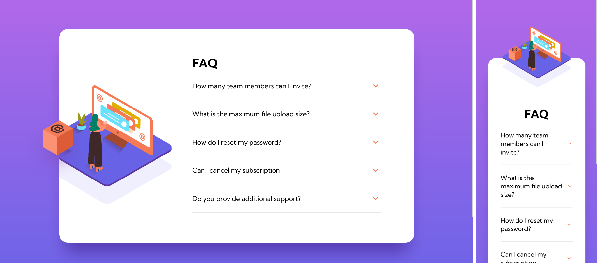

# Frontend Mentor - FAQ accordion card solution

This is a solution to the [FAQ accordion card challenge on Frontend Mentor](https://www.frontendmentor.io/challenges/faq-accordion-card-XlyjD0Oam). Frontend Mentor challenges help you improve your coding skills by building realistic projects. 

## Table of contents

- [Overview](#overview)
  - [The challenge](#the-challenge)
  - [Screenshot](#screenshot)
  - [Links](#links)
- [My process](#my-process)
  - [Built with](#built-with)
  - [What I learned](#what-i-learned)
  - [Continued development](#continued-development)
  - [Useful resources](#useful-resources)
- [Author](#author)
- [Acknowledgments](#acknowledgments)


## Overview

### The challenge

Users should be able to:

- View the optimal layout for the component depending on their device's screen size
- See hover states for all interactive elements on the page
- Hide/Show the answer to a question when the question is clicked

### Screenshot



### Links

- Solution URL: [Github solution](https://github.com/brunomoleta/probable-palm-tree)
- Live Site URL: [Accordeon app](https://accordion-faq-react-scss.netlify.app/)

## My process

- Started developing the architecture of the components,
went on to style the container with its illustration and 
details tags. It seemed it would be easy, but it turned out 
more complicated because of the overlapping 
illustration. 

- Took a break from that to go back to the main feature
of the app, keeping only one details tag open.

- After that, the responsivity was managed.

### Built with

- Semantic HTML5 markup
- Sass
- clsx
- React's Context
- [React](https://reactjs.org/) - JS library

### What I learned

The main feature was to have only ´´´details´´´ tag
 highlighted, and the rest should stay closed.
The following is complete with the following code:

```jsx
  const activateItem = () => {
  if (active.length === 0) {
    addId(id);
  } else if (active[0] === id) {
    removeId();
  } else {
    removeAddId(id);
  }
};

<summary
          onClick={activateItem}
          className={
            active[0] === item.id ? summaryClassesBold : summaryClasses
          }
        >
```

To ensure that the layout is responsive on both desktop and mobile, it uses dynamic units,
mainly the percentage type of unit, so the illustration stays at the same place wherever the width.

```css
.illustration {
  top: -70%;
  width: clamp(55%, 80dvw, 70%);

  @media (min-width: 801px) {
    top: inherit;
    width: 100%;
    left: -3.5rem;
  }

  .overflow {
    @media (min-width: 801px) {
      overflow: hidden;
    }
  }

}
```
Through this challenge, it was valuable to explore the ```details```tag. Here's the component used:

```jsx
  <>
  <details
          aria-expanded={active[0] === id}
          open={()=> true}
          className={detailsClasses}
  >
    <summary
            onClick={activateItem}
            className={summaryClass}
    >
      {summary}
      <RiArrowDownSLine
              className={arrowClass}
              size={32}
              strokeWidth={active[0] === id ? 2.5 : 1}
              color={active[0] === id && "var(--color-bg)"}
      />
    </summary>
    <p className={active[0] === id ? "paragraph medium" : "paragraph"}>
      {paragraph}
    </p>
  </details>
  <canvas
          className={active[0] === id ? canvasClasses : "canvas"}
  ></canvas>
    </>
```

### Continued development

Style the components with something other than Sass. Perhaps Lit
or 100% Tailwind. Beyond that, use Typescript.

### Useful resources

- [Jad Joubran's HTML/CSS course](https://learnhtmlcss.online/) - Learned about the details tag.

## Author

- Github - [Bruno Moleta](https://github.com/brunomoleta)
- Frontend Mentor - [@brunomoleta](https://www.frontendmentor.io/profile/brunomoleta)
- LinkedIn - [@brunomoleta](https://www.linkedin.com/in/bruno-moleta-santos/)

## Acknowledgments

I thank my colleagues Igor Braga and Ramon Carvalho for helping me with the Open the Details tag feature. To debug code with mates is an invaluable asset.